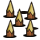
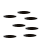
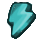
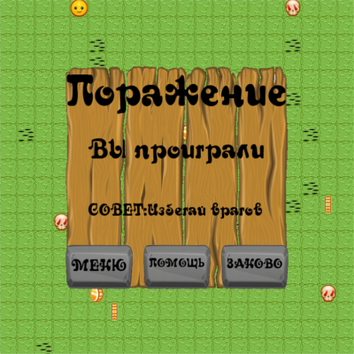
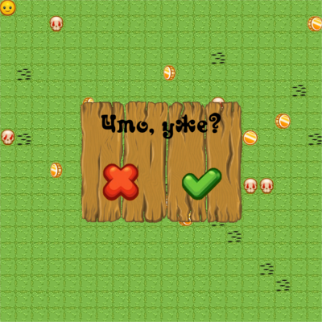

# Collector
Выполненный проект представляет собой 2D игру-аркаду, в которой игрок должен выполнить поставленную в уровне задачу.
Чем-то похоже на классического Бомбермена...да лишь тем, что тут есть бомбы.

**Содержание**
- [Установка](#setting)
  - [Установка через сборку пакета](#package)
  - [Установка исходников](#clone)
- [Правила игры](#game_rules)
  - [Альманах персонажей](#almanac)
  - [Управление](#controls)
- [Прочие фичи](#other_features)
- [Участники проекта](#credits)


## Установка <a name="setting"></a>
Есть два варианта установки: с помощью python-пакета или с помощью клонирования исходников.
### Установка через сборку пакета <a name="package"></a>

Чтобы собрать свой python-пакет с игрой, Вам понадобятся руки, setuptools и wheel.

Для начала создайте whl-файл с помощью следующей команды в терминале:

```
python setup.py bdist_wheel
```

Далее с помощью pip установите ваш whl-файл с помощью команды:
```
pip install dist/CollectorGame-0.0.1-py3-none-any.whl
```
Готово! Теперь можно насладиться игрой, выполнив следующие команды:

```
>>> from CollectorGame import run_me
>>> run_me.run_game()
```

### Установка исходников <a name="clone"></a>
Однако можно поиграть и напрямую! Для этого склонируйте репозиторий:
```
git clone https://github.com/bayten/collector-game
```

Если Вы счастливый пользователь Windows, то доустановите необходимые пакеты:
```
pip install -r requirements.txt
```

Теперь чтобы запустить игру, достаточно лишь написать в терминале:
```
python3 main.py
```
(а если разрешите файлу быть исполняемым с помощью ```chmod -x main.py```, то: 
```
./main.py
```
)
# Правила игры <a name="game_rules"></a>
Иногда надо просто собрать все монеты, а иногда убить всех врагов. 
Мы против игрового насилия, поэтому в демоверсии нужно будет просто собрать все монеты.  

## Альманах персонажей <a name="almanac"></a>
. Основной игрок. Понятия не имеет, зачем ему эти монеты, 
зато умеет ходить с помощью стрелочек и ставить бомбы с помощью пробела.

. Обычное деревце, которое является естественной преградой и не переносит взрывов. 
Кстати, есть ещё и огнеупорное дерево, на тот случай, если у кого-то окажется слишком много бомб.

. Колышки... Какой-то добрый человек понатыкал их по всему полю.
А ещё они любят выпрыгивать из скрытых дырок , когда вы по ним пройдётесь. Хорошо, что они хотя бы сделаны из обычного дерева и прекрасно горят.

. Монетка. Судя по всему, шоколадная, так как плавится при взрыве. Поскольку вам нужно собрать ВСЕ монетки,  плавить их не рекомендуется.

. Череп нерадивого студента. Мечется по всему полю в поисках преподавателя, чтобы досдать ему свой проект и закрыть дедлайны. Не вставайте на его пути - зашибёт.


. Разные бонусы...которые не были реализованы, потому что автор стал летающим черепом. Но в планах имеются!

## Управление <a name="controls"></a>
Стрелки - перемещение. Можно даже ходить по диагонали, да... Это фича, честно.

Пробел - поставить бомбу. Бомбу можно ставить только стоя на месте. Привет, Counter Strike.

Цифры 3-7 - поставить таймер взрыва на бомбе. Если вдруг вы профессионал, то пожалуйста, прошу.

# Остальные фичи<a name="other_features">
Сделан GUI на примитивном уровне. Кнопки-картинки-текстовые поля. Для примера реализованы два диалога: при победе-поражении и при закрытии игры.




# Участники<a name="credits"></a>
0.  Байтеков Никита (617 группа)
