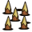
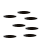
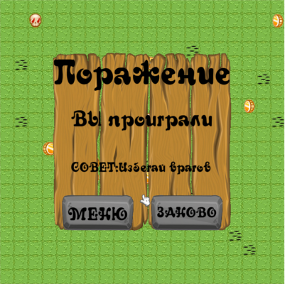
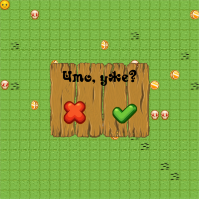

# Collector
2D игра-аркада, в которой игрок должен выполнить поставленную в уровне задачу.
Чем-то похоже на классического Бомбермена...да лишь тем, что тут есть бомбы.

# Правила игры:
Иногда надо просто собрать все монеты, а иногда убить всех врагов. 
Мы против игрового насилия, поэтому в демоверсии нужно будет просто собрать все монеты.  

. Основной игрок. Понятия не имеет, зачем ему эти монеты, 
зато умеет ходить с помощью стрелочек и ставить бомбы с помощью пробела.

. Обычное деревце, которое является естественной преградой и не переносит взрывов. 
Кстати, есть ещё и огнеупорное дерево, на тот случай, если у кого-то окажется слишком много бомб.

. Колышки... Какой-то добрый человек понатыкал их по всему полю.
А ещё они любят выпрыгивать из скрытых дырок , когда вы по ним пройдётесь. Хорошо, что они хотя бы сделаны из обычного дерева и прекрасно горят.

. Монетка. Судя по всему, шоколадная, так как плавится при взрыве. Поскольку вам нужно собрать ВСЕ монетки,  плавить их не рекомендуется.

. Череп нерадивого студента. Мечется по всему полю в поисках преподавателя, чтобы досдать ему свой проект и закрыть дедлайны. Не вставайте на его пути - зашибёт.

. Разные бонусы...которые не были реализованы, потому что автор стал летающим черепом. Но в планах имеются!

# Управление:
Стрелки - перемещение. Можно даже ходить по диагонали, да... Это фича, честно.

Пробел - поставить бомбу. Бомбу можно ставить только стоя на месте. Привет, Counter Strike.

Цифры 3-7 - поставить таймер взрыва на бомбе. Если вдруг вы профессионал, то пожалуйста, прошу.

# Остальные фичи:
Сделан GUI на примитивном уровне. Кнопки-картинки-текстовые поля. Для примера реализованы два диалога: при победе-поражении и при закрытии игры.

# Участники:
0.  Байтеков Никита (617 группа)
